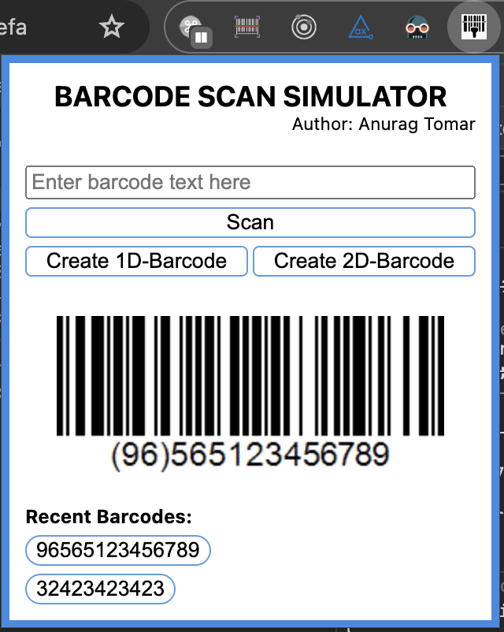
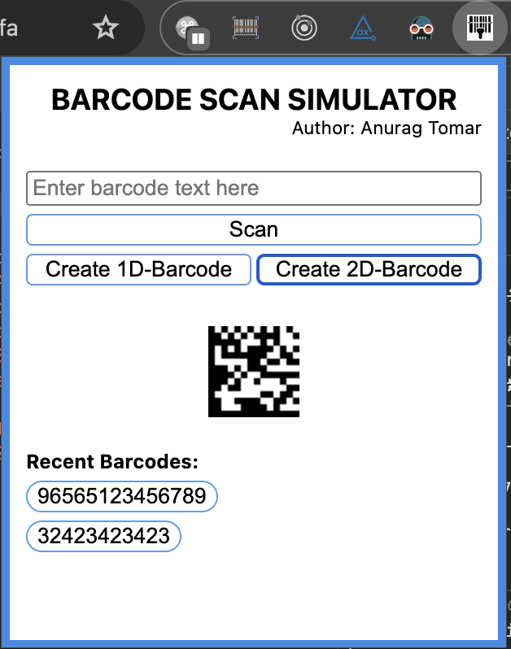

# barcode-scanner-simulator
This is a chrome extension that allows the user to simulate a barcode scan and also allows them to create linear and 2D barcodes.
This mimics barcode scanning where the scanner uses keyboard like input for the scan.

# How to use this?
1. Download this repo in your machine. [click here to download](https://github.com/atomar2000/barcode-scanner-simulator/releases/latest)
2. Run ``npm install``
3. Go to ``chrome://extensions/`` and Enable Developer Mode on the top right hand side.
4. Click on ``Load unpacked`` on the top left hand side.
5. Browse and select the downloaded folder from step 1.
6. Now, click on the extensions icon on the top right of your browser screen and pin this extension to your chrome.
7. And THAT'S IT! Enjoy hassle free barcode scanning! 🙂🎊

---
## This is how the UI looks

